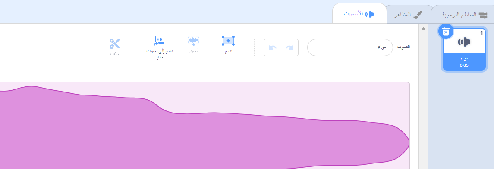
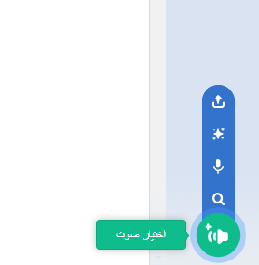
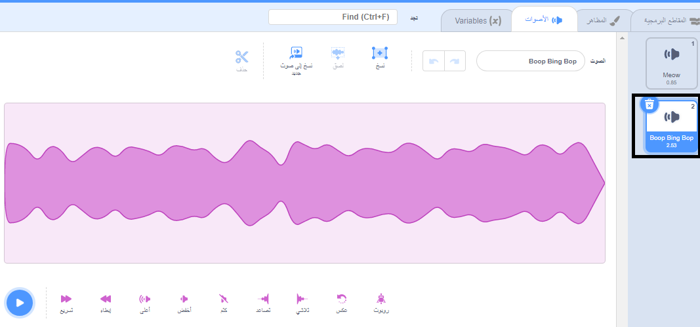
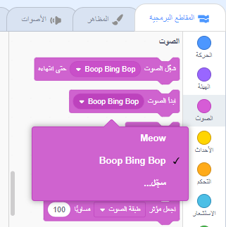

حدد الكائن الذي تريد الحصول على الصوت الجديد، ثم حدد علامة التبويب **أصوات**. يبدأ كل كائن بصوت افتراضي.

تحتوي منصة سكراتش على مكتبة من الأصوات التي يمكنك إضافتها إلى الكائنات المتحركة الخاصة بك. انقر فوق **اختيار الصوت** لرؤية جميع الأصوات.

لتشغيل صوت ، ضع مؤشر الماوس (أو إصبعك على الكمبيوتر اللوحي) فوق رمز **تشغيل**.

انقر فوق أي صوت لإضافته إلى كائنك. ستتم إعادتك مباشرة إلى **الأصوات** وستتمكن من رؤية الصوت الذي أضفته للتو.

إذا قمت بالتبديل إلى **التعليمة البرمجية** التبويب ونظرة على `صوت`{:class="block3sound"} القائمة التعليمات البرمجية، سوف تكون قادرا على تحديد الصوت الجديد.

**نصيحة:** يمكنك أيضًا إضافة أصوات إلى **المسرح**.
