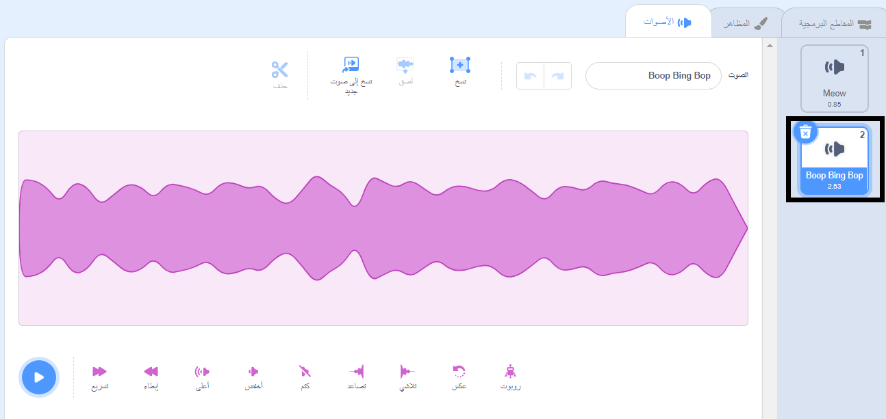

حدد الكائن الذي تريد الحصول على الصوت الجديد، ثم حدد علامة التبويب **أصوات**. Each sprite starts with a default sound:

تحتوي منصة سكراتش على مكتبة من الأصوات التي يمكنك إضافتها إلى الكائنات المتحركة الخاصة بك. Click on the **Choose a Sound** icon to open the Sound Library:

To play a sound, hold your mouse cursor (or your finger, if you are using a tablet) over the **Play** icon:

انقر فوق أي صوت لإضافته إلى كائنك. You will be taken straight back to the **Sounds** tab and you will be able to see the sound that you have just added:

If you switch to the **Code** tab and look at the `Sound`{:class="block3sound"} blocks menu, you will be able to select the new sound:

**نصيحة:** يمكنك أيضًا إضافة أصوات إلى **المسرح**.
