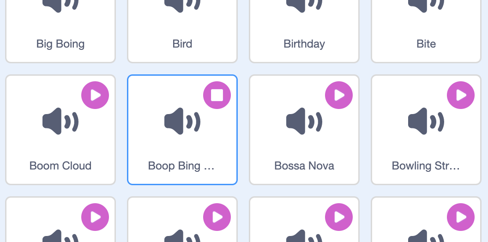

Dewisa'r corlun rwyt ti am roi'r sain newydd iddo, wedyn dewis y tab **Seiniau**. Mae pob corlun yn dechrau gyda sain ddiofyn:

Mae gan Scratch lyfrgell o seiniau y galli di eu hychwanegu at dy gorluniau. Clicia ar yr eicon **Dewiswch Sain** i agor y Llyfrgell Corluniau:

I chwarae sain, dalia gyrchwr dy lygoden (neu dy fys, os wyt ti'n defnyddio tabled) dros yr eicon **Chwarae**:

Clicia ar unrhyw sain i'w ychwanegu i dy brosiect. Byddi di'n cael dy dywys yn syth yn ôl i'r tab **Seiniau** a byddi di'n gallu gweld y sain rwyt ti newydd ei ychwanegu:

Os byddi di'n newid i'r tab **Cod** ac yn edrych ar y ddewislen blociau `Sain`{:class="block3sound"}, byddi di'n gallu dewis y sain newydd:

**Awgrym:** Galli di hefyd ychwanegu seiniau at **Llwyfan**.
