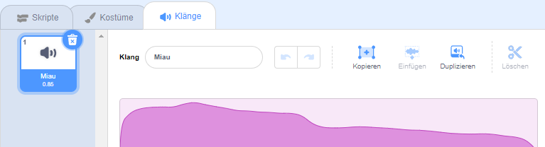
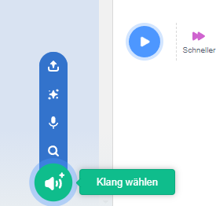
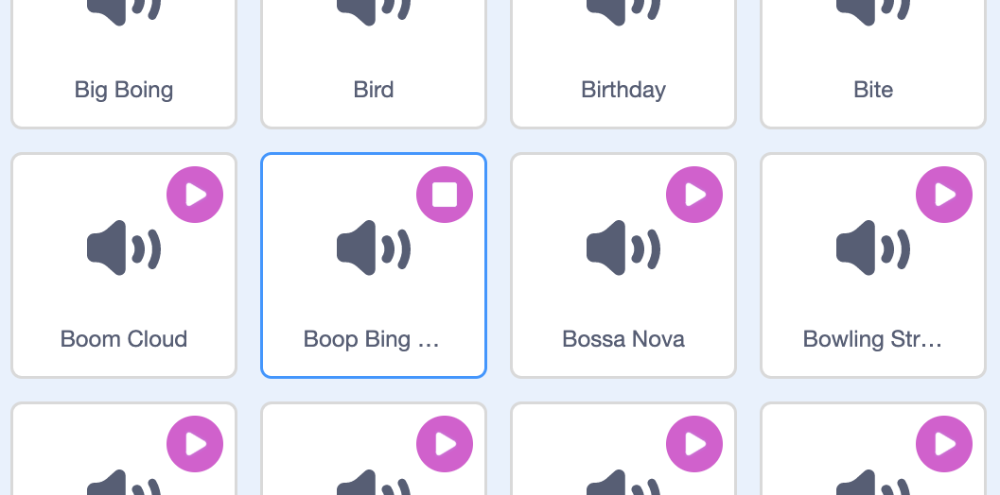
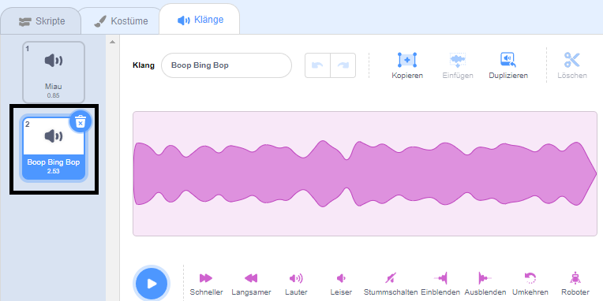
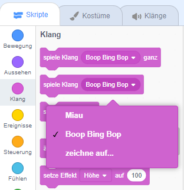

Wähle die Figur aus, die den neuen Klang haben soll, und wähle dann die Registerkarte **Klänge**. Jede Figur beginnt mit einem Standard-Klang:

Scratch verfügt über eine Bibliothek mit Klängen, die du deinen Figuren hinzufügen kannst. Klicke auf **Klang wählen**, um die Bibliothek aller in Scratch vorhandener Klänge anzuzeigen:

Um einen Klang abzuspielen, halte den Mauszeiger (oder deinen Finger, wenn du ein Tablet verwendest) über das Symbol **Abspielen**:

Klicke auf einen Klang, um ihn deiner Figur hinzuzufügen. Du wirst direkt zur Registerkarte „**Klänge**“ zurückgeleitet und kannst den Klang sehen, den du gerade hinzugefügt hast:

Wenn du zur Registerkarte **Skripte** wechselst und dir das Blockmenü `Klang`{:class="block3sound"} ansiehst, kannst du den neuen Klang auswählen:

**Tipp:** Du kannst auch der **-Bühne** Klänge hinzufügen.
