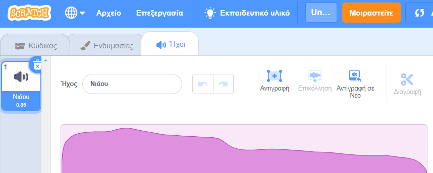
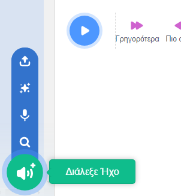
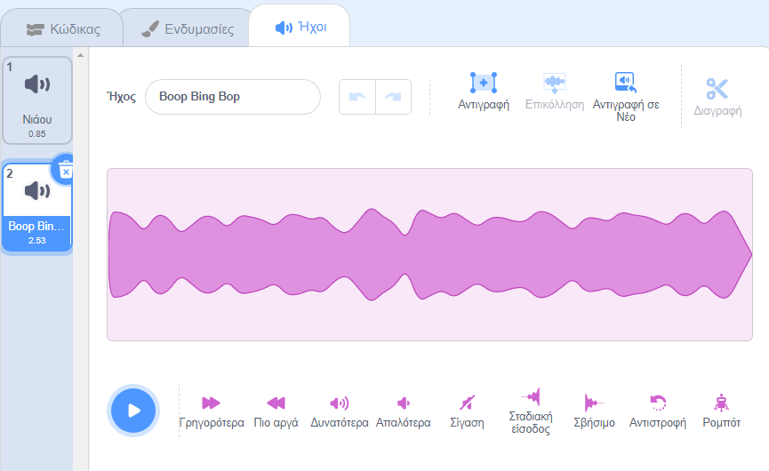
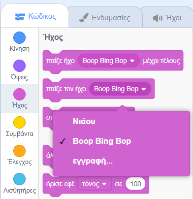

Επίλεξε το αντικείμενο που θέλεις να έχεις τον νέο ηχογραφημένο ήχο και, στη συνέχεια, επίλεξε την καρτέλα **Ήχοι**. Κάθε αντικείμενο ξεκινά με έναν προεπιλεγμένο ήχο:

Το Scratch διαθέτει μια βιβλιοθήκη ήχων που μπορείς να προσθέσεις στα αντικείμενά σου. Κάνε κλικ στο εικονίδιο **Διάλεξε Ήχο** για να ανοίξεις τη Βιβλιοθήκη Ήχων:

Για να παίξεις έναν ήχο, κράτησε πατημένο τον δρομέα του ποντικιού (ή το δάχτυλό σου, αν χρησιμοποιήσεις tablet) πάνω από το εικονίδιο **Αναπαραγωγή**:

Κάνε κλικ σε ένα οποιοδήποτε αντικείμενο για να το προσθέσεις στο αντικείμενό σου. Θα μεταφερθείς κατευθείαν στην καρτέλα **Ήχοι** και θα μπορείς να δεις τον ήχο που μόλις πρόσθεσες:

Εάν μεταβείς στην καρτέλα **Κώδικας** και κοιτάξεις το μενού μπλοκ `Ήχος`{:class="block3sound"}, θα μπορείς να επιλέξεις τον νέο ήχο:

**Συμβουλή:** Μπορείς επίσης να προσθέσεις ήχους στη **Σκηνή**.
