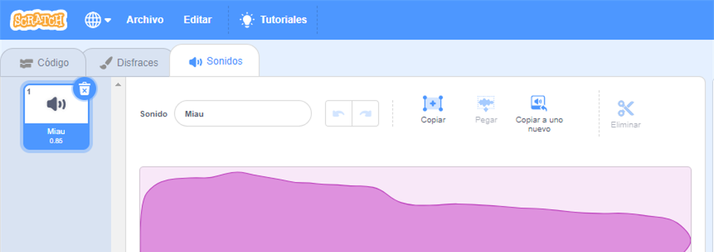
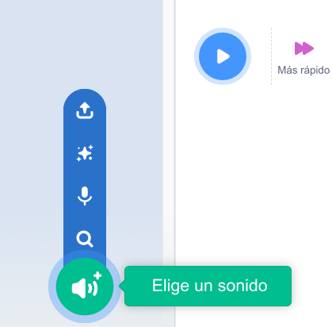
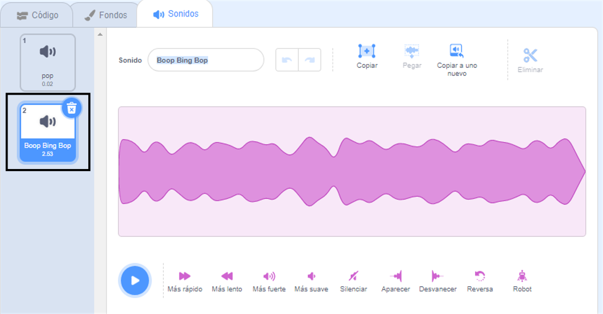
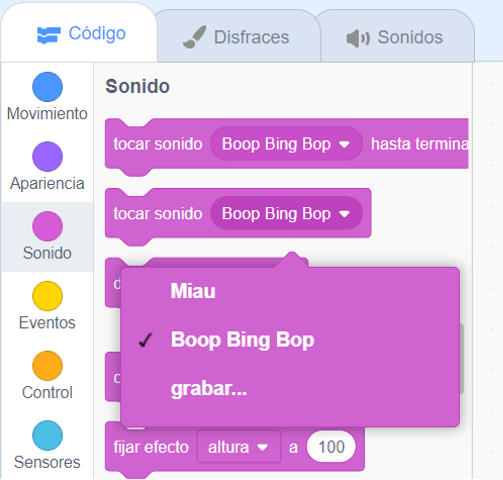

Selecciona el objeto que deseas que tenga el nuevo sonido, luego selecciona la pestaña **Sonidos**. Cada objeto comienza con un sonido predeterminado:

Scratch tiene una biblioteca de sonidos que puedes agregar a tus objetos. Haz clic en el ícono **Elige un sonido** para abrir la Biblioteca de Sonidos:

Para reproducir un sonido, mantén el puntero del ratón (o el dedo, si estás usando una tableta) sobre el icono **Reproducir**:

Haz clic en cualquier sonido para agregarlo a tu objeto. Volverás directamente a la pestaña **Sonidos** y podrás ver el sonido que acabas de agregar:

Si cambias a la pestaña **Código** y miras el menú de bloques `Sonido`{:class="block3sound"}, podrás seleccionar el nuevo sonido:

**Consejo:** También puedes agregar sonidos al **Escenario**.
