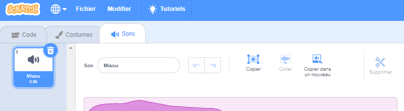
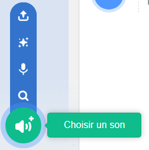
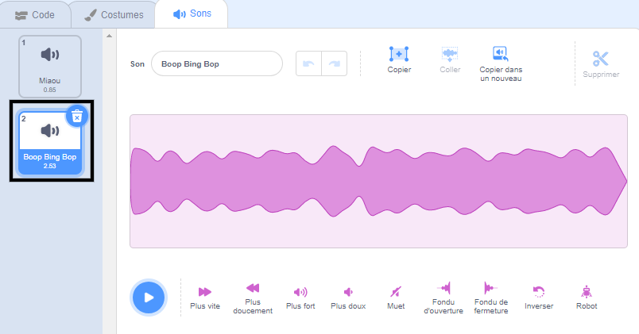

Sélectionne le sprite dont tu souhaites avoir le nouveau son, puis sélectionne l'onglet **Sons**. Chaque sprite commence avec un son par défaut.

Scratch a une bibliothèque de sons que tu peux ajouter à tes sprites. Clique sur le **Choisir un son** pour voir tous les sons.

Pour lire un son, maintiens le curseur de la souris (ou le doigt sur une tablette) sur l'icône **Jouer**.

Clique sur n'importe quel son pour l'ajouter à ton sprite. Tu seras redirigé directement vers l'onglet **Sons** et tu pourras voir le son que tu viens d'ajouter.

Si tu passes à l'onglet **Code** et regarde les blocs `Son`{:class="block3sound"}, tu pourras sélectionner le nouveau son.

**Astuce :** tu peux également ajouter des sons à la **Scène**.
