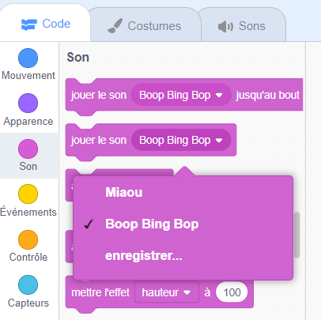

Sélectionne le sprite dont tu souhaites avoir le nouveau son, puis sélectionne l'onglet **Sons**. Each sprite starts with a default sound:

Scratch a une bibliothèque de sons que tu peux ajouter à tes sprites. Click on the **Choose a Sound** icon to open the Sound Library:

To play a sound, hold your mouse cursor (or your finger, if you are using a tablet) over the **Play** icon:

Clique sur n'importe quel son pour l'ajouter à ton sprite. You will be taken straight back to the **Sounds** tab and you will be able to see the sound that you have just added:

If you switch to the **Code** tab and look at the `Sound`{:class="block3sound"} blocks menu, you will be able to select the new sound:

**Astuce :** tu peux également ajouter des sons à la **Scène**.
