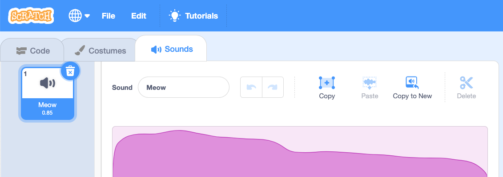

वह स्प्राइट चुनें जिसे आप नई आवाज़ देना चाहते हैं, फिर **Sounds** टैब चुनें। प्रत्येक स्प्राइट एक डिफ़ॉल्ट आवाज़ के साथ शुरू होता है:

स्क्रैच में आवाज़ की एक लाइब्रेरी होती है जिसे आप अपने स्प्राइट्स में जोड़ सकते हैं। आवाज़ लाइब्रेरी खोलने के लिए **Choose a Sound** पर क्लिक करें:

आवाज़ चलाने के लिए, अपना माउस कर्सर (या अपनी उंगली, यदि आप टैबलेट का उपयोग कर रहे हैं) को **Play** पर रखें:

किसी भी आवाज़ को अपने स्प्राइट में जोड़ने के लिए उस पर क्लिक करें। आपको सीधे **Sounds** टैब पर ले जाया जाएगा और आप उस आवाज़ को देख पाएंगे जिसे आपने अभी जोड़ा है:

यदि आप **Code** टैब पर स्विच करते हैं और `Sounds`{:class="block3sound"} ब्लॉक मेनू को देखते हैं, तो आप नई आवाज़ को चुन सकते हैं:

**टिप्पणी:** आप **Stage**में आवाज़ भी जोड़ सकते हैं।

