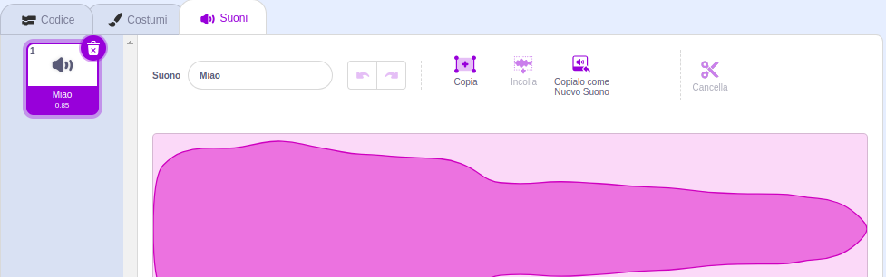
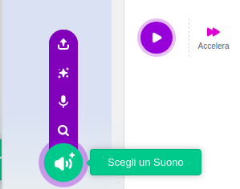
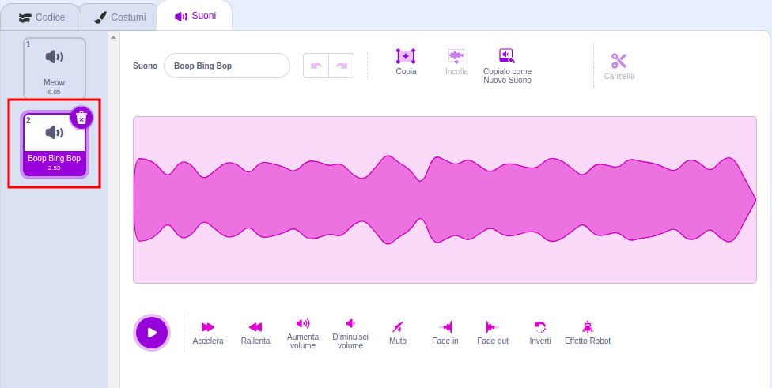
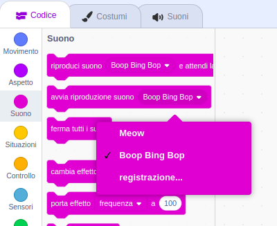

Seleziona lo sprite a cui vuoi aggiunger il nuovo suono, poi seleziona la scheda **Suoni**. Ogni sprite viene creato con un suono predefinito:

Scratch ha una libreria di suoni che puoi aggiungere ai tuoi sprite. Fai clic sull'icona **Scegli un Suono** per aprire la Libreria dei suoni:

Per riprodurre un suono, porta il cursore del mouse (o il dito, se stai utilizzando un tablet) sull'icona **Riproduci** e cliccala:

Fai clic su un qualsiasi suono per aggiungerlo al tuo sprite. Verrai riportato direttamente alla scheda **Suoni** e potrai vedere il suono che hai appena aggiunto:

Se passi alla scheda **Codice** e guardi il menu dei blocchi `Suono`{:class="block3sound"}, potrai selezionare il nuovo suono:

**Suggerimento:** puoi anche aggiungere suoni allo **Stage**.
