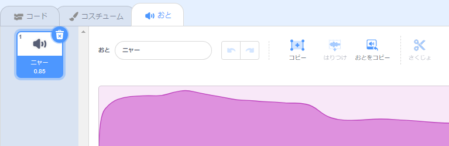
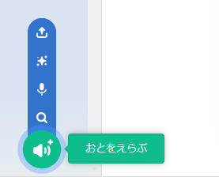
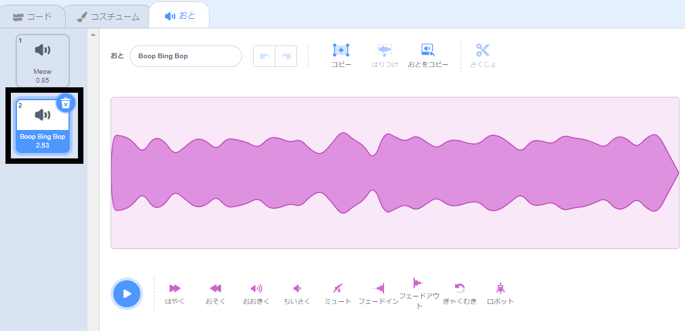
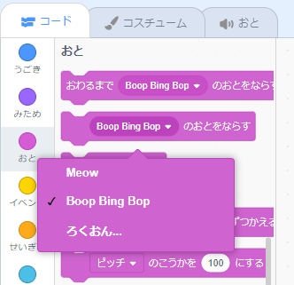

新しいサウンドを作成するスプライトを選択してから、**音**タブを選択します。 各スプライトは標準のサウンドで始まります。

Scratchには、スプライトに追加できる音のライブラリがあります。 **音を選ぶ** アイコンをクリックして、サウンドライブラリを開きます

**再生** アイコンの上にマウスカーソル（またはタブレットを使用している場合は指）を置きます。

サウンドをクリックして、スプライトに追加します。 **音**タブに直接戻り、追加したばかりのサウンドを確認できます。

**コード** タブに切り替えて、 `Sound`{：class = "block3sound"}ブロックメニューを見ると、新しいサウンドを選択できます。

**ヒント：** また、あなたは **ステージ**にサウンドを追加することができます。
