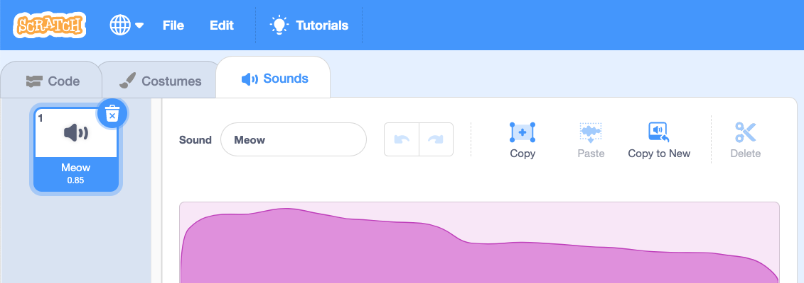
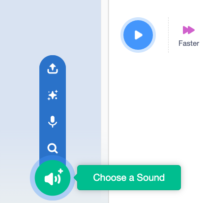
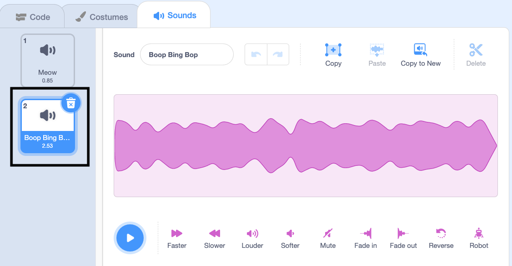

ನೀವು ರೆಕಾರ್ಡ್ ಮಾಡಿದ ಹೊಸ ಧ್ವನಿಯನ್ನು ಹೊಂದಲು ಬಯಸುವ ಸ್ಪ್ರೈಟ್ ಅನ್ನು ಆಯ್ಕೆ ಮಾಡಿ, ನಂತರ **Sounds** ಟ್ಯಾಬ್ ಅನ್ನು ಆಯ್ಕೆ ಮಾಡಿ. ಪ್ರತಿ ಸ್ಪ್ರೈಟ್ ಡೀಫಾಲ್ಟ್ ಧ್ವನಿಯೊಂದಿಗೆ ಪ್ರಾರಂಭವಾಗುತ್ತದೆ:

ಸ್ಕ್ರಾಚ್ ಶಬ್ದಗಳ ಗ್ರಂಥಾಲಯವನ್ನು ಹೊಂದಿದ್ದು ಅದನ್ನು ನಿಮ್ಮ ಸ್ಪ್ರೈಟ್‌ಗಳಿಗೆ ಸೇರಿಸಬಹುದು. ಸೌಂಡ್ ಲೈಬ್ರರಿಯನ್ನು ತೆರೆಯಲು **Choose a Sound** ಐಕಾನ್ ಆಯ್ಕೆ ಮಾಡಿ:

ಧ್ವನಿಯನ್ನು ಪ್ಲೇ ಮಾಡಲು, ನಿಮ್ಮ ಮೌಸ್ ಕರ್ಸರ್ ಅನ್ನು (ನೀವು ಟ್ಯಾಬ್ಲೆಟ್ ಬಳಸುತ್ತಿದ್ದರೆ ನಿಮ್ಮ ಬೆರಳು) **Play** ಐಕಾನ್ ಮೇಲೆ ಹಿಡಿದುಕೊಳ್ಳಿ:

ನಿಮ್ಮ ಸ್ಪ್ರೈಟ್‌ಗೆ ಸೇರಿಸಲು ಯಾವುದೇ ಧ್ವನಿಯ ಮೇಲೆ ಕ್ಲಿಕ್ ಮಾಡಿ. ನಿಮ್ಮನ್ನು ನೇರವಾಗಿ **Sounds** ಟ್ಯಾಬ್‌ಗೆ ಕರೆದೊಯ್ಯಲಾಗುತ್ತದೆ ಮತ್ತು ನೀವು ಈಗ ಸೇರಿಸಿರುವ ಧ್ವನಿಯನ್ನು ನೋಡಲು ಸಾಧ್ಯವಾಗುತ್ತದೆ:

ನೀವು **Code** ಟ್ಯಾಬ್‌ಗೆ ಬದಲಾಯಿಸಿ ಮತ್ತು `Sound`{:class="block3sound"} ಬ್ಲಾಕ್ ಮೆನುವನ್ನು ನೋಡಿದರೆ, ನೀವು ರೆಕಾರ್ಡ್ ಮಾಡಿದ ಹೊಸ ಧ್ವನಿಯನ್ನು ಆಯ್ಕೆ ಮಾಡಲು ಸಾಧ್ಯವಾಗುತ್ತದೆ:

**Tip:** **Stage** ಗೆ ಶಬ್ದಗಳನ್ನು ಕೂಡ ಸೇರಿಸಬಹುದು.
