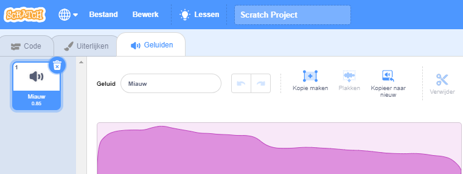

Selecteer de sprite waarvoor je een nieuw geluid wilt hebben en selecteer vervolgens het tabblad **Geluiden**. Elke sprite begint met een standaardgeluid:

Scratch heeft een bibliotheek met geluiden die je aan je sprites kunt toevoegen. Klik op de **Kies een geluid** knop om alle geluiden te zien.

Om een geluid af te spelen, houdt je de muiscursor (of vinger op een tablet) boven het pictogram **Afspelen**.

Klik op een geluid om het aan je sprite toe te voegen. Je komt meteen terug in het **Geluiden** tabblad en ziet het geluid dat je zojuist hebt toegevoegd.

Als je naar het **Code** tabblad gaat en kijkt naar de `Geluid`{:class="block3sound"} blokken, kun je je nieuwe geluid gebruiken:

**Tip:** Je kunt ook geluiden toevoegen aan het **Speelveld**.
