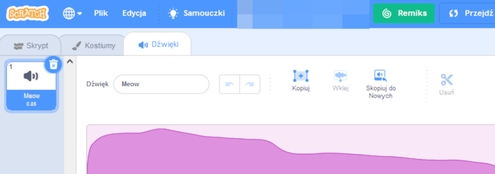
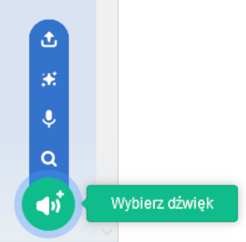
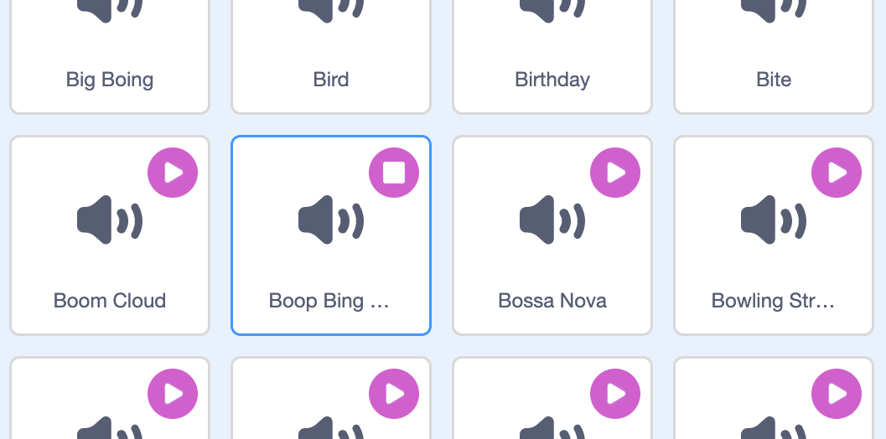
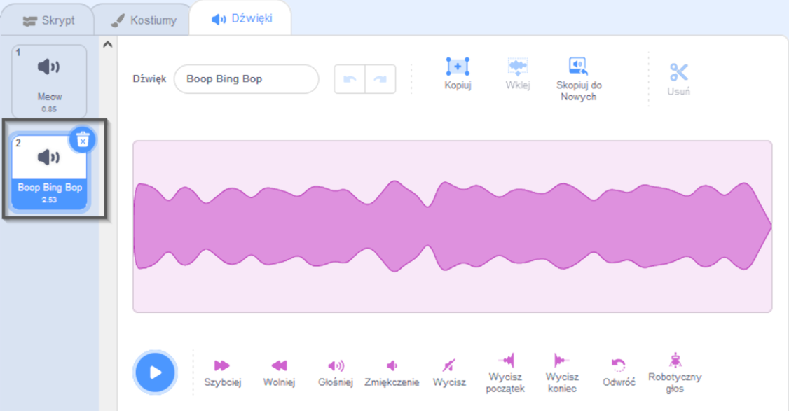
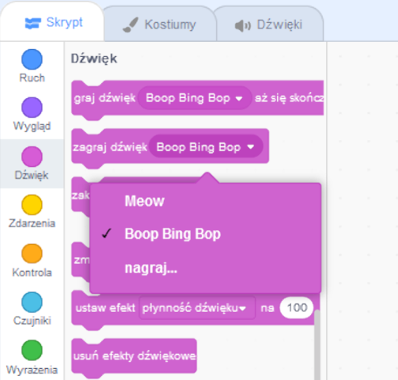

Wybierz duszka, któremu chcesz dodać nowy dźwięk, a następnie wybierz zakładkę **Dźwięki**. Każdy duszek zaczyna z domyślnym dźwiękiem:

Scratch posiada bibliotekę dźwięków, które możesz dodać do swoich duszków. Kliknij **Wybierz dźwięk** aby otworzyć Bibliotekę dźwięków:

Aby odtworzyć dźwięk, przytrzymaj kursor myszy (lub palec, jeśli używasz tabletu) nad ikoną **Zagraj**:

Kliknij dowolny dźwięk, aby dodać go do swojego duszka. Zostaniesz przeniesiony z powrotem do zakładki **Dźwięki** i będziesz mógł zobaczyć właśnie dodany dźwięk:

Jeśli przejdziesz do zakładki **Skrypt** i spojrzysz na menu bloków `Dźwięk`{:class="block3sound"}, będziesz mógł wybrać nowy dźwięk:

**Wskazówka:** Możesz także dodać dźwięki do **Sceny**.
