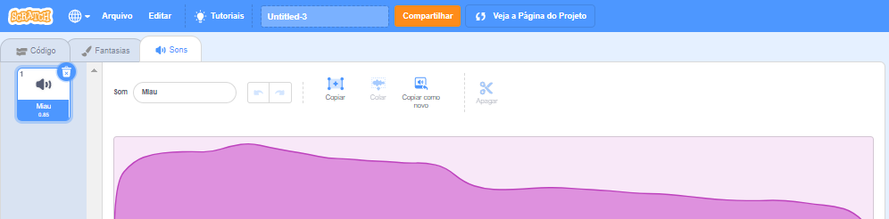
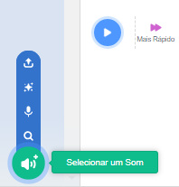
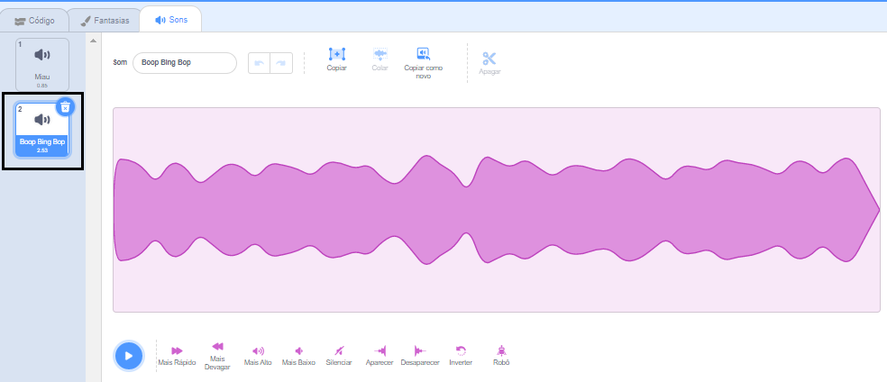
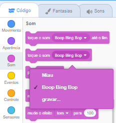

Select the sprite that you want to have the new sound, then select the **Sounds** tab. Cada ator começa com um som padrão:

Scratch has a library of sounds that you can add to your sprites. Click on the **Choose a Sound** icon to open the Sound Library:

To play a sound, hold your mouse cursor (or your finger, if you are using a tablet) over the **Play** icon:

Click on any sound to add it to your sprite. Você será levado de volta à aba **Sons** e poderá ver que o som foi adicionado:

If you switch to the **Code** tab and look at the `Sound`{:class="block3sound"} blocks menu, you will be able to select the new sound:

**Tip:** You can also add sounds to the **Stage**.
