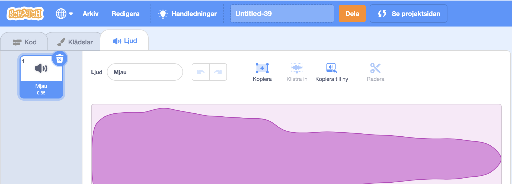
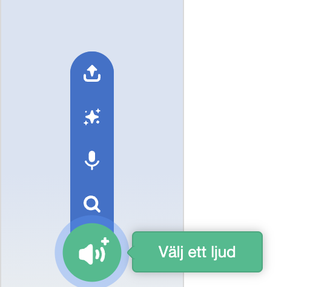
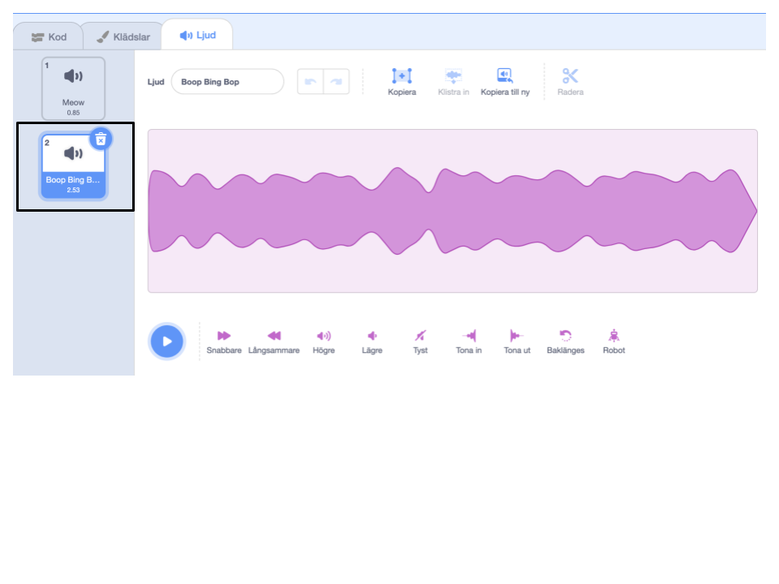
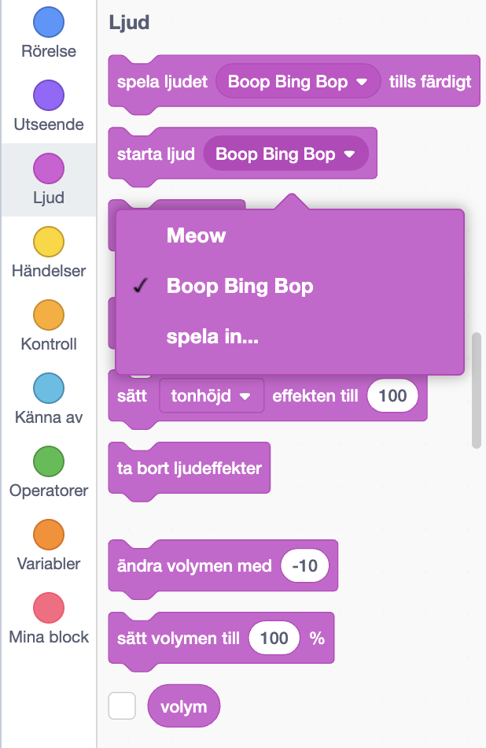

Välj sprajten som du vill ska ha det nya ljudet på och välj sedan **Ljud**fliken. Varje sprajt börjar med ett standardljud:

Scratch har ett bibliotek med ljud som du kan lägga till dina sprajter. Klicka på **"Välj ett ljud"**-ikonen för att öppna ljudbiblioteket:

För att spela upp ett ljud, håll muspekaren (eller fingret, om du använder en surfplatta) över ikonen **Spela**:

Klicka på valfritt ljud för att lägga till det till din sprajt. Du kommer direkt tillbaka till **Ljud**fliken och kommer kunna se ljudet som du precis har lagt till:

Om du byter till **Kod**-fliken och tittar på menyn `Ljud`{:class="block3sound"}block, kommer du att kunna välja det nya ljudet:

**Tips:** Du kan också lägga till ljud till **Scenen**.
