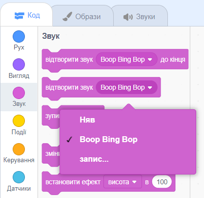

Вибери спрайт, якому ти хочеш додати новий звук та перейди на вкладку **Звуки**. Кожен спрайт починається зі стандартного звуку:

Scratch має власну бібліотеку звуків, які можна додавати до спрайтів. Натисни **Обрати звук**, щоб відкрити Бібліотеку звуків:

Щоб відтворити звук, наведи курсор миші (або палець, якщо використовуєш планшет) на іконку **Відтворити**:

Клацни на будь-який звук, щоб додати його до спрайта. Ти повернешся на вкладку **Звуки** та зможеш побачити звук, який щойно був створений:

Якщо ти перейдеш на вкладку **Код** і подивишся на меню блоків `Звук`{:class="block3sound"}, ти зможеш вибрати новий звук:

**Порада:** до **Сцени** також можна додавати звуки.
